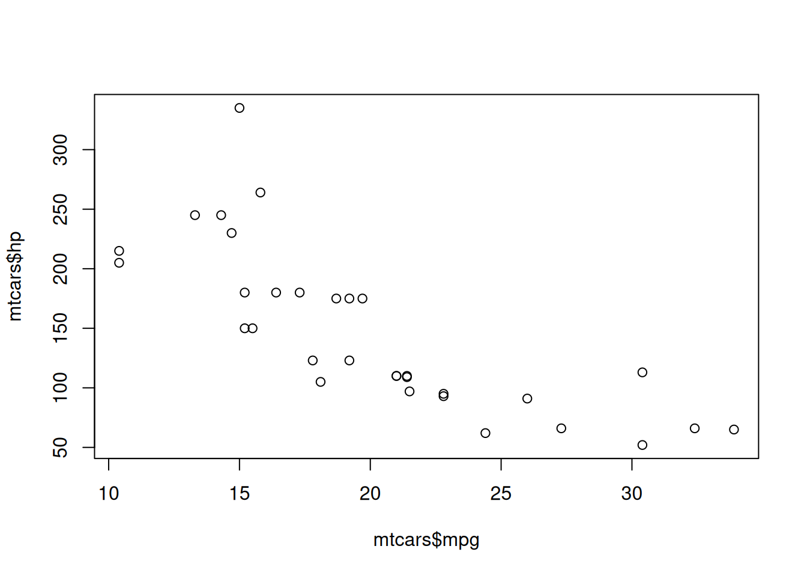

# Quarto Overview

A brief overview of Quarto and how we use it to create our website

## What is Quarto?

[Quarto](https://quarto.org) is an open-source scientific and technical publishing system built on [Pandoc](https://pandoc.org). It allows you to create documents, presentations, websites, books, and more using straightforward Markdown syntax. We use Quarto to build our websites because it provides a powerful and flexible way to manage content and publish it in a variety of formats. For example, we can write our tutorials in Markdown and then use Quarto to generate HTML pages for our website, as well as PDF, PowerPoint, and Word documents for sharing, printing, and repurposing.

Quarto is the successor to RMarkdown and is designed to be more flexible and powerful than its predecessor. It also has a growing ecosystem of extensions and plugins that allow you to customize your documents and add new features. If you come from a Python background, the Markdown syntax and other features of Quarto should feel familiar — you can use Python code chunks in your documents just like you would in Jupyter notebooks.

### The `.qmd` file format

A Quarto document (`.qmd`) is essentially a plain-text file that combines three elements:

1.  **YAML front matter** — An optional block of metadata at the very top of the file, enclosed between `---` lines, where you set the title, author, date, output format, and various rendering options.
2.  **Markdown content** — The body of your document, written in [Pandoc-flavored Markdown](https://pandoc.org/MANUAL.html#pandocs-markdown), which supports headings, lists, links, images, tables, math equations, and more.
3.  **Code chunks** — Executable code blocks fenced with ```` ```{language} ```` that can be written in R, Python, Julia, or [Observable JS](https://quarto.org/docs/interactive/ojs/). Code chunks can be run during rendering so their outputs (plots, tables, printed results) are included directly in the final document.

This combination makes `.qmd` files an example of *literate programming*: your narrative and your code live in the same file, making your analysis more transparent, reproducible, and easier to maintain.

### Quarto projects vs. standalone documents

Quarto can render individual `.qmd` files in isolation, but for a project like a tutorial series or a website, you will typically work with a **Quarto project** — a folder containing a `_quarto.yml` configuration file alongside your `.qmd` files, images, and other assets. The `_quarto.yml` file controls:

- The **project type** (e.g. `website`, `book`, `manuscript`)
- **Navigation** — how pages are linked and ordered in the menu
- **Global defaults** for rendering options, applied across all pages
- **Output directory** — where the rendered files are placed

When it comes to formatting and styling your documents, Quarto provides many options for customizing the appearance of your content. You can use CSS to style your HTML output, and you can also use YAML front matter to specify options for your documents, such as the title, author, date, and more.

> **TIP:**
>
> For a more detailed introduction, check out the [official Quarto documentation](https://quarto.org/docs/). There is also an extensive [Quarto Guide](https://quarto.org/docs/guide/) with reference material on all aspects of the system.

## Working with Quarto

### The `tutorial-template` repository

We developed the [`tutorial-template`](https://github.com/lmu-osc/tutorial-template) repository to provide a standardized starting point for all of our tutorials. This template includes a basic structure for a Quarto project, as well as pre-configured settings and styles that we use across all tutorials. When you create a new tutorial, you can simply clone the repository and start editing the content.

The goal of the template is to make it quick and easy to create new tutorials without having to worry about the technical details of setting up a Quarto project from scratch. By providing a standardized template, we ensure that all tutorials have a consistent look and feel, and we make it easier for new authors to get started creating content for our website.

### Installing Quarto

We assume you can download and install Quarto on your local machine. If you have any issues, please reach out and we can help you get set up. Once Quarto is installed, you can use it by running the `quarto` command in your terminal. See the [command reference](https://quarto.org/docs/cli/) for a full list of available commands.

You will only need a handful of commands on a regular basis:

- **`quarto preview`** — preview the project locally (the command you will use most often)
- **`quarto add`** — add extensions to your project
- **`quarto publish`** — publish your project to GitHub Pages (discussed in more detail in the following chapters)

### Typical workflow

Here is how we generally expect authors to work with a Quarto project:

1.  **Create a new project.** In the context of the `tutorial-template`, this simply means cloning the repository and opening it in your code editor.

2.  **Open the project properly.** Use your preferred text editor (e.g. VS Code, Positron, RStudio). Be sure to open the *folder* containing the project files, not just individual files. This allows your editor to recognize the project structure and provide features like syntax highlighting and file navigation. The terminal will also be set to the project directory, which is important for running Quarto commands and other scripts that rely on relative file paths.

3.  **Edit the content.** For the `tutorial-template`, this primarily means creating and editing `.qmd` files and including them in the `_quarto.yml` file so they appear in the website navigation. Each `.qmd` file can have its own YAML front matter to set the title, subtitle, and other page-specific options. You can also edit other files such as CSS for styling or YAML files for configuration.

    Inside a `.qmd` file, you can:

    - Write richly formatted text using Markdown (headings, lists, links, images, tables)
    - Include executable code chunks for R, Python, Julia, or Observable JS
    - Add callout blocks, cross-references, figures, and other Quarto-specific elements
    - Set per-page options in the YAML front matter (e.g. a different page title or a custom sidebar)

4.  **Preview your changes.** Run `quarto preview` in the terminal. This starts a local web server and opens your default browser to display the website. As you save changes, the preview automatically updates to reflect them.

    > **Important:** Do not use the “Render” button in RStudio or the “Run” button in VS Code to preview Quarto documents. These may not render the website correctly and can lead to confusion. Always use `quarto preview` in the terminal.

5.  **Use version control.** Work on a dedicated git branch, make regular commits with descriptive messages, and push your changes to GitHub frequently. This helps you keep track of your changes and makes it easier to collaborate with others. See the [Tech Overview](../tech-overview.llms.md) and the [GitHub Review](../github/review.llms.md) pages for more information on working with git and GitHub.

## Common Quarto Features

Here are some of the most commonly used Quarto features that you will encounter when creating tutorials:

### Figures and images

Quarto provides flexible options for adding images to your documents. You can include local images from your `images/` folder or link to external images. Images can be given captions, cross-references, and custom sizing:

``` markdown
{#fig-example width=80%}

See @fig-example for an illustration of the concept.
```

See the [figures documentation](https://quarto.org/docs/authoring/figures.html) for details.

### Cross-referencing

Cross-referencing is highly recommended for tutorials with multiple pages. It allows you to easily link to other pages, sections, figures, tables, or equations in your tutorial and ensures those links stay up-to-date, even if you change the structure later on. To cross-reference a heading, add an identifier with the `{#my-id}` syntax:

``` markdown
## Data Preparation {#sec-data-prep}

As discussed in @sec-data-prep, you should clean your data first.
```

Learn more about [cross-references in Quarto](https://quarto.org/docs/authoring/cross-references.html).

### Callout blocks

Callout blocks are a great way to highlight important information, provide tips, warnings, and more. They make your content more engaging and easier to read. Quarto supports several callout types:

``` markdown
::: {.callout-note}
This is a note — useful for general information.
:::

::: {.callout-warning}
This is a warning — draw attention to potential pitfalls.
:::

::: {.callout-important}
This highlights something critical that readers must not miss.
:::
```

See the [callouts documentation](https://quarto.org/docs/authoring/callouts.html) for usage instructions.

### Code chunks

Code chunks let you include executable code in your tutorial. The code runs when the document is rendered, and its output (plots, tables, console output) is inserted directly into the page. You can control chunk behavior with options such as:

``` r
plot(mtcars$mpg, mtcars$hp)
```



My plot

Quarto supports R, Python, Julia, and Observable JS code chunks. See the [code execution documentation](https://quarto.org/docs/computation/) for more details.

### Tables

You can create both plain Markdown tables and more advanced formatted tables with captions and cross-references:

``` markdown
| Method      | Description                  |
|-------------|------------------------------|
| `qmd`       | Quarto document file         |
| `yml`       | Configuration file           |
| `css`       | Custom stylesheet            |

: Supported file types {#tbl-filetypes}
```

And the resulting table will look like this:

| Method | Description          |
|--------|----------------------|
| `qmd`  | Quarto document file |
| `yml`  | Configuration file   |
| `css`  | Custom stylesheet    |

Table 1: Supported file types

The table here is even cross-referencable with `@tbl-filetypes`: [Table 1](#tbl-filetypes). Learn more about [tables in Quarto](https://quarto.org/docs/authoring/tables.html).

### Further exploration

There is much more to discover in the [Authoring](https://quarto.org/docs/authoring/) and [Websites](https://quarto.org/docs/websites/) sections of the Quarto guide. A few other useful features worth exploring:

- **Divs and spans** — Apply custom CSS classes or attributes to blocks of content or inline text
- **Citations and bibliographies** — Reference academic papers and generate a reference list automatically
- **Video embedding** — Include videos from YouTube, Vimeo, or local files
- **Math equations** — Write LaTeX math rendered with MathJax or KaTeX
- **Interactive documents** — Use Observable JS, Shiny, or Dash for interactive elements

Feel free to explore these resources, ask your favorite LLM, or reach out to other OSC members for recommendations on useful Quarto features.

> **TIP:**
>
> The features listed above are some of the most commonly used in our tutorials and are a good starting point for new authors. Take the time to familiarize yourself with them and consider how they can enhance your tutorials before you start creating content.

Back to top
