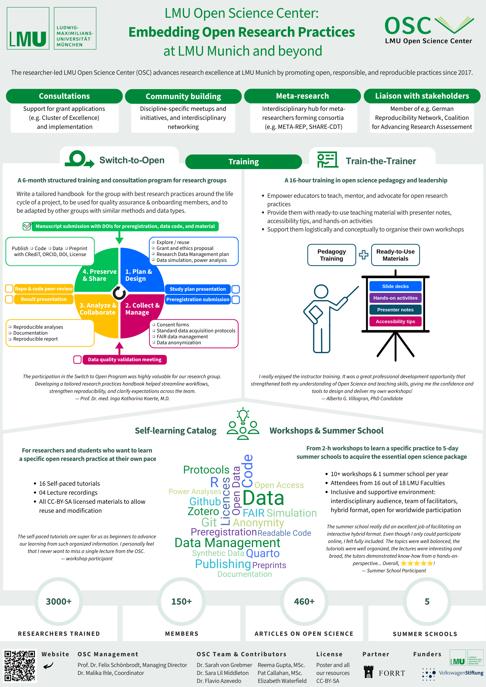
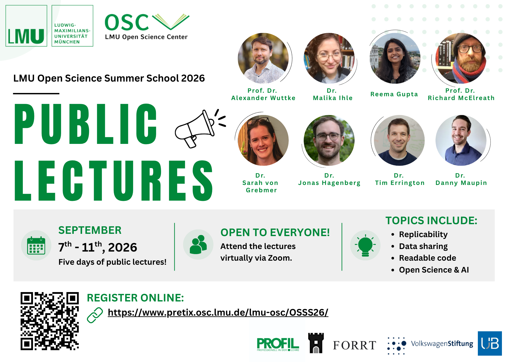

# Flyer Design and Images

Code

This page provides resources and recommendations for creating promotional materials for the OSC, including flyers, posters, social media graphics, and other visual content.

## Flyer Templates

The OSC maintains a PowerPoint template that can be used as a starting point for designing flyers and promotional materials.

- [OSC Flyer Template](https://docs.google.com/presentation/d/188QPtIdl2IjIXbJcthXYj3QCBCJURbqJ/edit?slide=id.p1#slide=id.p1)

## Printing Services

### LMU In-House Printing Service

The official printing service for LMU is the **Hausdruckerei (Ricoh Deutschland GmbH Printcenter LMU)**.

You can find additional information, including price lists and forms, on the LMU Service Portal:

- [LMU In-House Printing Service Information](https://www.serviceportal.verwaltung.uni-muenchen.de/services/beschaffung/ausstatt_rahmenvertr_dienstlst/hausdruckerei/index.html)

| Information | Details |
|----|----|
| Responsible person | Thomas |
| Address | Ricoh Deutschland GmbH, Hausdruckerei der LMU, Ludwig-Maximilians-Universität München, Leopoldstr. 3, 80802 München |
| Phone | 089/2180-3669 |

### Opening Hours

| Day             | Opening Hours     |
|-----------------|-------------------|
| Monday–Thursday | 9:00 AM – 3:00 PM |
| Friday          | Closed            |

To print materials (e.g., flyers or posters), contact the print shop by email or phone to discuss your requirements.

- Email: `hausdruckerei@lmu.de`

### External Printing Option: Printy

An affordable external option for printing, particularly for large posters, is **Printy**.

- Website: [Printy](https://printy.de/en/homepage-english-2/)

| Information     | Details                          |
|-----------------|----------------------------------|
| Location        | Luisenstraße 49, 80333 Munich    |
| Nearby landmark | Near the TUM Main Campus         |
| Opening hours   | Monday–Friday, 9:30 AM – 5:00 PM |

#### Typical Printing Workflow with Printy

1.  Visit the Printy website.
2.  Go to **Price Calculators → Large Poster Calculator**.
3.  Keep the default settings:
    - A0 format
    - 145 g silk matt paper
    - Indoor/outdoor presentation
    - Pickup at Luisenstraße 49
    - Receipt
4.  Click **Request Order**.
5.  An email window containing the order details will open automatically.
6.  Attach a PDF version of your poster.
7.  Edit the email if necessary and send it.
8.  Wait for confirmation (usually within the same day) and collect the poster.

> **NOTE:**
>
> For reference, printing an A0 poster at Printy typically costs around **€15.00**.

## Canva

**Canva** is a free-to-use online graphic design platform that can be used to create social media posts, presentations, posters, logos, videos, and other visual content.

- [Canva Website](https://www.canva.com/de_de/)
- [Beginner’s Guide to Canva](https://www.canva.com/learn/how-to-canva-beginners-guide/)

When creating on Canva, either get access to OSC’s Canva account or use your own personal account and invite the OSC as a collaborator. The design created on Canva should remain accessible to the OSC.

Here are some examples of flyers made on Canva:

### Examples of Flyers Created in Canva

## Announcement flyer for the Open Science Summer School 2026

## Conference poster

## Announcement flyer for the Public Lectures 2026

## Microsoft PowerPoint

### Using PowerPoint for Image Creation

PowerPoint is frequently used within the OSC to create flyers, social media graphics, logos, and other visual materials.

### Helpful Tips

#### Adjusting Slide Dimensions

To change the dimensions of a slide:

1.  Go to the **Design** tab.
2.  Click **Slide Size**.
3.  Select **Custom Slide Size**.
4.  Enter the desired dimensions.

#### Working with Images

When importing images into PowerPoint, color changes may not always appear exactly as expected. For the most accurate color reproduction, use images in **SVG format**.

Many websites provide free SVG icons, for example:

- <https://iamvector.com/>

Recommended workflow:

1.  Download the icon as an SVG file.
2.  Save it locally.
3.  Insert the SVG into PowerPoint.

### Why Use SVG?

SVG images are recommended because they:

- preserve image quality at all sizes;
- can be recolored more accurately in PowerPoint;
- are ideal for use on websites and in digital materials.

> **TIP:**
>
> 1.  Navigate to the slide you want to export.
> 2.  Click **File → Save As**.
> 3.  Change the file format from `.pptx` to **Scalable Vector Graphics Format (.svg)**.
> 4.  Click **Save**.
> 5.  When prompted, select **Just This One**.
>
> This will export only the current slide as an SVG image.
