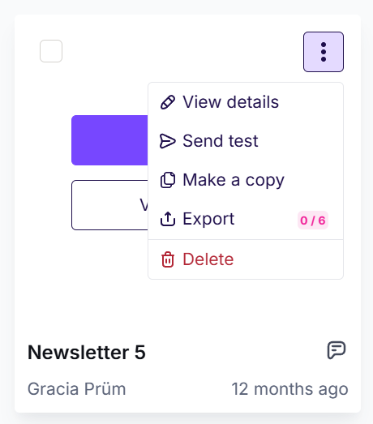
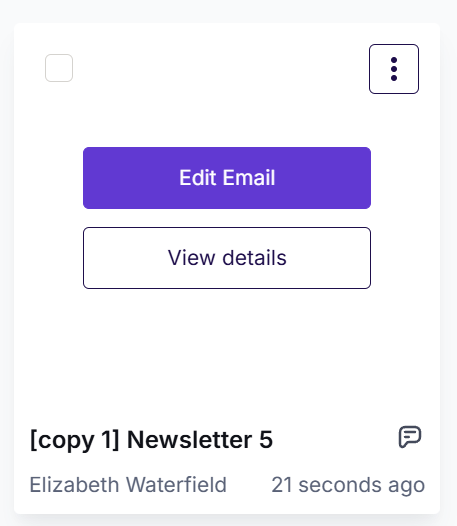
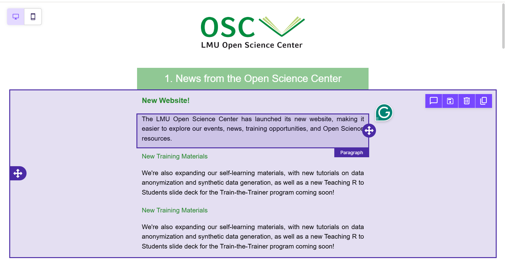
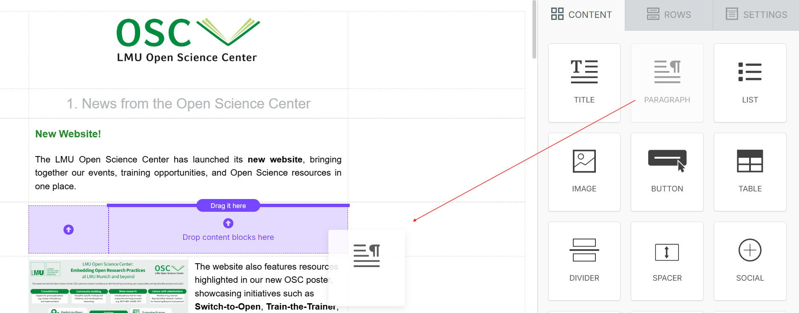
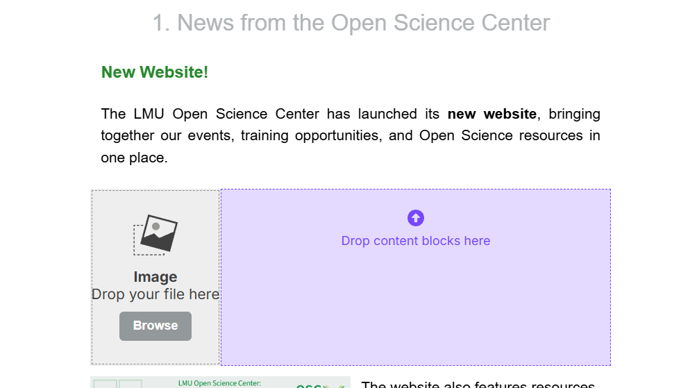
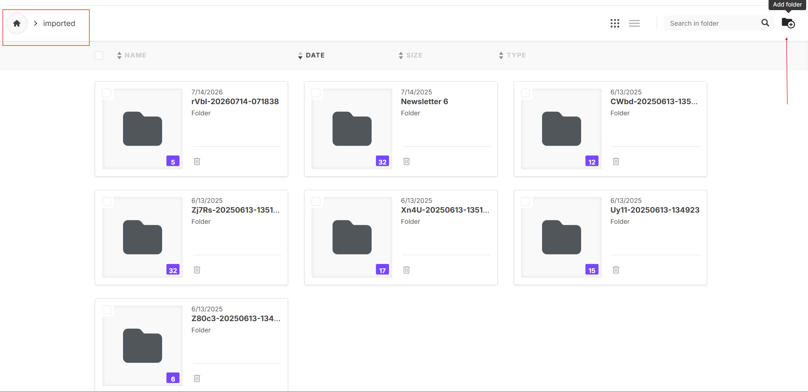
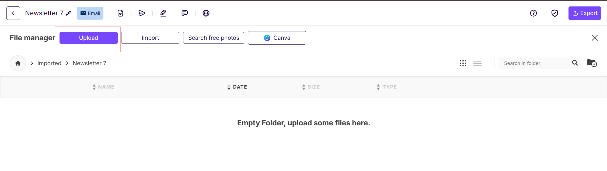

# Newsletter

Code

For newsletter creation we use **ReallyGoodEmails** (formally known as **Beefree**)

## Administration

!!!REVISE Link for Login: https://beefree.io  
Login with this mail: osc@psy.lmu.de  
Project for the Newsletter is called “OSC organization”

## Create a Newsletter

To create a new newsletter, **copy the most recent newsletter** to ensure the design and formatting remain consistent.

1.  Open the previous newsletter.
2.  Click the **three dots (⋮)**.
3.  Select **Make a copy**.

This provides a standardized starting point and helps maintain consistency across all newsletters.

### Standardization Checklist

Before publishing, ensure the following elements are consistent throughout the newsletter:

- **Date format**
  - Use one consistent format throughout (e.g., **Jan. 8, 2026**).
  - Avoid mixing formats such as:
    - Jan 8
    - Jan. 8
    - Jan 8, 2026
- **Time format**
  - Use a consistent style (e.g., **14:00** or **2:00 PM**).
  - Ensure event times are included whenever applicable.
- **Academic titles**
  - Use titles consistently (e.g., **Prof. Dr.**).
- **Spacing**
  - Maintain consistent spacing between:
    - Titles and body text
    - Paragraphs
    - Images and text
- **Heading numbering**
  - Ensure numbered headings continue sequentially throughout the newsletter.
- **Text alignment**
  - Body text should be **justified** (aligned on both the left and right).
- **Currency formatting**
  - Use a consistent format for monetary values (e.g., **€500,000** or **500,000 €**, depending on the chosen style).
- **Event information**
  - Present event details in a consistent order throughout the newsletter.
- **Links**
  - Verify that every hyperlink works correctly before publishing.

## Adding Content to the Newsletter

After creating a copy of the previous newsletter, you can begin replacing the old content with the new one.

First, click **Edit Email**.

The editor may seem overwhelming at first, but it becomes much easier with practice.

The newsletter is built using **Rows** and **Content** blocks.

### Understanding Rows and Content

- **Rows** define the overall layout of a section.
  - For example:
    - One column
    - Two columns
    - Three columns
- **Content** blocks are the elements placed inside those rows, such as:
  - Images
  - Paragraphs
  - Headings
  - Buttons
  - Dividers
  - Social media icons

To create a section:

1.  Drag the desired **Row** layout into the newsletter.
2.  Drag the appropriate **Content** blocks into each column of that row.
3.  Edit the content as needed.

> **TIP:**
>
> - Whenever possible, **duplicate existing sections** instead of creating new ones from scratch. This preserves:
>
>   - Font size
>   - Font colour
>   - Spacing
>   - Alignment
>   - Overall formatting
>
> - The standard keyboard shortcuts (**Ctrl + Z** on Windows or **⌘ + Z** on macOS) generally **do not work** within the editor.
>
> - Although an **Undo** button is available in the bottom-left corner, using it can occasionally disrupt the layout or reorder recently added content.
>
> - Whenever possible, correct mistakes manually by:
>
>   - Deleting unwanted content
>   - Retyping text
>   - Moving content blocks back into place
>
> This helps avoid unexpected formatting issues.

## Adding Images

Adding images follows a standard workflow to keep the media library organised.

### Step 1 — Insert an Image Block

Drag an **Image** content block into the appropriate row.

Then click **Browse**.

------------------------------------------------------------------------

### Step 2 — Create an Image Folder

Inside the image browser:

1.  Open the **Imported** folder.
2.  Create a **new folder** named after the current newsletter.

This keeps all images for a particular newsletter together and makes them easier to locate later.

------------------------------------------------------------------------

### Step 3 — Upload Images

Upload all images required for the newsletter into the newly created folder.

Once uploaded, select the desired image and insert it into the newsletter.

Following this folder structure helps keep the image library organised and simplifies future updates or revisions.

Back to top
