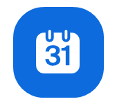

# Internal Communication

Code

# Communication and Administration

This section provides information about the main communication channels, meeting organization, Zoom access, and office logistics used at the OSC.

## Email and LMU Chat (Matrix)

The OSC primarily uses **email** and **LMU Chat (Matrix)** for communication.

### Email

You will receive an **([**lmu.de?**](#ref-lmu.de)) email account**. Malika will submit a ticket to the IT department to initiate the account creation process.

You can access your mailbox via <https://xmail.mwn.de>

Email should be used for:

- Important communications that need to be documented
- Tasks that cannot be completed immediately
- Formal communication with researchers, instructors, and external organizations

> **TIP:**
>
> It is still acceptable to communicate with OSC staff through your personal email address and when using Google Workspace platforms.

### LMU Chat (Matrix)

**Matrix** is an open, decentralized platform for real-time communication. LMU hosts its own Matrix server, called **LMU Chat**, which serves as the central messaging platform for university members.

The recommended application for accessing LMU Chat is **Element**, which is available for:

- Windows
- macOS
- Linux
- iOS
- Android

LMU Chat is the preferred communication channel for:

- Quick back-and-forth discussions
- Short tasks and questions
- FYIs and informal communication
- Team coordination

#### Getting Started

For detailed instructions on setting up your Matrix account and installing Element, consult the official LMU documentation:

- [LMU Chat (Matrix) Documentation](https://www.lmu.de/en/about-lmu/structure/central-university-administration/it-services-division-vi/it-service-desk/central-it-services/lmu-chat-matrix/)

Once your account is set up, join the OSC workspace using the following invitation link: [https://matrix.to/#/#lmu-open-science-center:matrix.lmu.de](https://matrix.to/#/#lmu-open-science-center:matrix.lmu.de)

## Setting Up Meetings

When scheduling meetings involving multiple participants, it is often helpful to first identify suitable meeting times.

Recommended scheduling tools include:

| Tool | Typical Use |
|----|----|
| [When2Meet](https://www.when2meet.com/) | Best when participants should indicate availability across several days. |
| [TerminPlaner](https://terminplaner6.dfn.de/) | Best when participants only need to choose among a small number of proposed time slots. |

### Scheduling a Zoom Meeting

To schedule a meeting using the Zoom desktop application:

1.  Sign in to the Zoom desktop application.
2.  Select the **Home** tab.
3.  Click **Schedule**.

This opens the **New Event** window.

4.  Enter a meeting title.
5.  Specify the date and time.
6.  Optionally add invitees by entering their names or email addresses.
7.  Configure additional meeting settings if necessary.
8.  Click **Save**.

> **IMPORTANT:**
>
> After scheduling a meeting, always send participants a calendar invitation (e.g., Outlook, Gmail, or an `.ics` attachment) containing the Zoom link.

## Zoom

Zoom is the primary platform used for OSC meetings, workshops, and webinars.

If you do not already have a Zoom Pro account, request one through [Faculty 11 Help Desk](https://helpdesk.fak11.lmu.de/)

After receiving a Zoom account, contact `it-servicedesk@lmu.de` and ask Faculty 11 to add **Zoom Webinar Pro** access (required for events such as the Open Science Summer School).

This is important because Malika may need to designate you as an **alternative host** for OSC events.

### Logging In

Use your **LMU email address** together with your **LRZ Single Sign-On credentials** to activate and access your Zoom account.

LMU Zoom portal: <https://lmu-munich.zoom.us/>

## Office and Equipment

The OSC office is located in:

| Room                     | Purpose                                  |
|--------------------------|------------------------------------------|
| **3320, Leopoldstr. 13** | Shared office space                      |
| **3321, Leopoldstr. 13** | Shared conference room used for meetings |

Access to these rooms is provided through a **transponder**, which Malika will request for you.

### Equipment Storage

The office contains important OSC equipment, including:

- 360° conference cameras
- Tripods
- Microphones
- Laptops
- Posters
- Printer access

Most equipment is stored in the **gray locker**.

The key to the locker can usually be found in Malika’s desk drawer.
